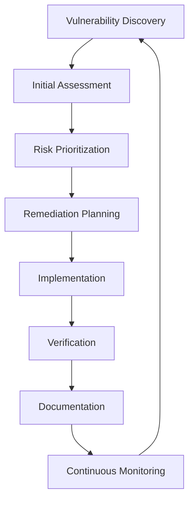

# Vulnerability Awareness and Management Standards

**Document Version:** 1.0.0  
**Last Updated:** 2025-01-07  
**Security Level:** SECURE  
**Compliance:** NIST SSDF, NIST CSF 2.0, SOC 2, CISA, OWASP  
**Scope:** RuneFrameOS Ecosystem  

## 📋 **Table of Contents**

1. [Overview](#overview)
2. [Vulnerability Management Framework](#vulnerability-management-framework)
3. [Vulnerability Identification](#vulnerability-identification)
4. [Vulnerability Assessment](#vulnerability-assessment)
5. [Vulnerability Tracking](#vulnerability-tracking)
6. [Remediation Procedures](#remediation-procedures)
7. [Continuous Monitoring](#continuous-monitoring)
8. [Compliance and Reporting](#compliance-and-reporting)
9. [Tools and Automation](#tools-and-automation)
10. [Training and Awareness](#training-and-awareness)

## 🎯 **Overview**

This document establishes comprehensive vulnerability awareness and management standards for the RuneFrameOS ecosystem, ensuring systematic identification, assessment, tracking, and remediation of security vulnerabilities across all components and infrastructure.

### **Key Principles**
- **Proactive Detection**: Continuous vulnerability scanning and assessment
- **Risk-Based Prioritization**: Focus on high-impact, high-likelihood vulnerabilities
- **Timely Remediation**: SLA-driven response times based on severity
- **Comprehensive Coverage**: All systems, applications, and infrastructure
- **Continuous Improvement**: Regular process evaluation and enhancement

## 🏗️ **Vulnerability Management Framework**

### **Organizational Structure**

```yaml
vulnerability_management_team:
  security_lead:
    - "Overall vulnerability management strategy"
    - "Risk assessment and prioritization"
    - "Compliance oversight"
  
  vulnerability_analysts:
    - "Vulnerability identification and assessment"
    - "False positive analysis"
    - "Remediation guidance"
  
  system_administrators:
    - "Infrastructure vulnerability remediation"
    - "Patch deployment"
    - "System hardening"
  
  developers:
    - "Application vulnerability remediation"
    - "Secure coding practices"
    - "Code review for vulnerabilities"
  
  operations_team:
    - "Deployment of security patches"
    - "Monitoring and alerting"
    - "Incident response coordination"
```

### **Process Flow**



## 🔍 **Vulnerability Identification**

### **Automated Scanning**

#### **Infrastructure Scanning**
```yaml
infrastructure_scanning:
  frequency: "Daily"
  tools:
    - "Nessus Professional"
    - "OpenVAS"
    - "Qualys Vulnerability Management"
  
  scope:
    - "All production servers"
    - "Development environments"
    - "Network infrastructure"
    - "Cloud resources (AWS, Azure, GCP)"
  
  scan_types:
    - "Authenticated scans (daily)"
    - "Unauthenticated scans (weekly)"
    - "Compliance scans (monthly)"
    - "Penetration testing (quarterly)"
```

#### **Application Scanning**
```yaml
application_scanning:
  static_analysis:
    tools:
      - "SonarQube"
      - "Snyk Code"
      - "Semgrep"
    frequency: "On every code commit"
    
  dynamic_analysis:
    tools:
      - "OWASP ZAP"
      - "Burp Suite Professional"
      - "Acunetix"
    frequency: "Weekly"
    
  dependency_scanning:
    tools:
      - "Snyk"
      - "Dependabot"
      - "OWASP Dependency Check"
    frequency: "Daily"
```

### **Manual Assessment**

#### **Code Review Process**
```python
# Vulnerability-focused code review checklist
VULNERABILITY_REVIEW_CHECKLIST = {
    "input_validation": [
        "SQL injection prevention",
        "XSS prevention",
        "CSRF protection",
        "Input sanitization"
    ],
    "authentication": [
        "Secure password handling",
        "Multi-factor authentication",
        "Session management",
        "Token security"
    ],
    "authorization": [
        "Access control implementation",
        "Role-based permissions",
        "Resource-level security",
        "Privilege escalation prevention"
    ],
    "data_protection": [
        "Encryption at rest",
        "Encryption in transit",
        "Secure key management",
        "Data classification"
    ],
    "error_handling": [
        "Secure error messages",
        "Exception handling",
        "Logging security",
        "Information disclosure prevention"
    ]
}
```

#### **Security Testing**
```yaml
security_testing:
  penetration_testing:
    frequency: "Quarterly"
    scope: "Full application stack"
    methodology: "OWASP Testing Guide v4.0"
    
  red_team_exercises:
    frequency: "Annually"
    scope: "End-to-end attack simulation"
    objectives: "Test detection and response capabilities"
    
  bug_bounty_program:
    scope: "Public-facing applications"
    rewards: "Based on severity and impact"
    triage: "24-hour initial response"
```

## 📊 **Vulnerability Assessment**

### **Risk Scoring Framework**

#### **CVSS-Based Scoring**
```yaml
cvss_scoring:
  base_metrics:
    attack_vector: ["Network", "Adjacent", "Local", "Physical"]
    attack_complexity: ["Low", "High"]
    privileges_required: ["None", "Low", "High"]
    user_interaction: ["None", "Required"]
    scope: ["Unchanged", "Changed"]
    confidentiality_impact: ["None", "Low", "High"]
    integrity_impact: ["None", "Low", "High"]
    availability_impact: ["None", "Low", "High"]
  
  temporal_metrics:
    exploit_code_maturity: ["Unproven", "Proof-of-Concept", "Functional", "High", "Not Defined"]
    remediation_level: ["Official Fix", "Temporary Fix", "Workaround", "Unavailable", "Not Defined"]
    report_confidence: ["Unknown", "Reasonable", "Confirmed", "Not Defined"]
  
  environmental_metrics:
    security_requirements: ["Not Defined", "Low", "Medium", "High"]
    modified_base_metrics: "Custom scoring based on environment"
```

#### **Business Impact Assessment**
```yaml
business_impact_factors:
  data_sensitivity:
    public: 1
    internal: 3
    confidential: 5
    restricted: 7
    classified: 10
  
  system_criticality:
    development: 1
    testing: 2
    staging: 3
    production: 5
    critical_infrastructure: 10
  
  exposure_level:
    internal_only: 1
    authenticated_users: 3
    public_read: 5
    public_write: 7
    internet_facing: 10
```

### **Prioritization Matrix**

```yaml
  prioritization_matrix:
    critical:
      cvss_score: "9.0-10.0"
      sla_remediation: "24 hours"
      notification: "Immediate"
      escalation: "C-level"
      auto_escalation: "30 minutes"
      
    high:
      cvss_score: "7.0-8.9"
      sla_remediation: "7 days"
      notification: "4 hours"
      escalation: "Security Lead"
      auto_escalation: "24 hours"
      
    medium:
      cvss_score: "4.0-6.9"
      sla_remediation: "30 days"
      notification: "24 hours"
      escalation: "Team Lead"
      auto_escalation: "7 days"
      
    low:
      cvss_score: "0.1-3.9"
      sla_remediation: "90 days"
      notification: "Weekly report"
      escalation: "None"
      auto_escalation: "30 days"
```

## 📈 **Vulnerability Tracking**

### **Vulnerability Database Schema**

```sql
-- Vulnerability tracking database schema
CREATE TABLE vulnerabilities (
    id UUID PRIMARY KEY DEFAULT gen_random_uuid(),
    title VARCHAR(255) NOT NULL,
    description TEXT,
    cvss_score DECIMAL(3,1),
    cvss_vector VARCHAR(100),
    severity VARCHAR(20) CHECK (severity IN ('Critical', 'High', 'Medium', 'Low')),
    status VARCHAR(20) DEFAULT 'Open' CHECK (status IN ('Open', 'In Progress', 'Resolved', 'False Positive', 'Accepted Risk')),
    discovered_date TIMESTAMP DEFAULT CURRENT_TIMESTAMP,
    due_date TIMESTAMP,
    resolved_date TIMESTAMP,
    affected_systems TEXT[],
    remediation_plan TEXT,
    assigned_to VARCHAR(100),
    created_by VARCHAR(100),
    updated_at TIMESTAMP DEFAULT CURRENT_TIMESTAMP,
    tags TEXT[]
);

CREATE TABLE vulnerability_scans (
    id UUID PRIMARY KEY DEFAULT gen_random_uuid(),
    scan_date TIMESTAMP DEFAULT CURRENT_TIMESTAMP,
    scanner_type VARCHAR(50),
    target_systems TEXT[],
    total_vulnerabilities INTEGER,
    critical_count INTEGER,
    high_count INTEGER,
    medium_count INTEGER,
    low_count INTEGER,
    scan_duration INTERVAL,
    scan_status VARCHAR(20)
);

CREATE TABLE remediation_activities (
    id UUID PRIMARY KEY DEFAULT gen_random_uuid(),
    vulnerability_id UUID REFERENCES vulnerabilities(id),
    activity_type VARCHAR(50),
    description TEXT,
    performed_by VARCHAR(100),
    performed_date TIMESTAMP DEFAULT CURRENT_TIMESTAMP,
    verification_status VARCHAR(20),
    notes TEXT
);
```

### **Tracking Dashboard Metrics**

```yaml
vulnerability_metrics:
  key_performance_indicators:
    critical_remediation_time: "Target: < 24 hours"
    high_remediation_time: "Target: < 7 days"
    medium_remediation_time: "Target: < 30 days"
    low_remediation_time: "Target: < 90 days"
    overall_mean_time: "Target: < 14 days (weighted by severity)"
    vulnerability_age_distribution: "Target: < 10% over 90 days"
    remediation_rate: "Target: > 95% within SLA"
    false_positive_rate: "Target: < 5%"
    
  trending_metrics:
    vulnerability_discovery_rate: "Weekly trend analysis"
    remediation_velocity: "Sprint-based tracking"
    risk_exposure: "Aggregate risk score"
    compliance_gaps: "Regulatory requirement tracking"
    
  reporting_frequency:
    daily: "Critical vulnerability status"
    weekly: "Remediation progress"
    monthly: "Trend analysis and metrics"
    quarterly: "Comprehensive assessment"
```

## 🔧 **Remediation Procedures**

### **Standard Remediation Workflow**

```yaml
remediation_workflow:
  step_1_assessment:
    - "Verify vulnerability existence"
    - "Assess business impact"
    - "Determine remediation approach"
    - "Estimate effort and timeline"
    
  step_2_planning:
    - "Create detailed remediation plan"
    - "Identify affected systems"
    - "Schedule maintenance windows"
    - "Prepare rollback procedures"
    
  step_3_implementation:
    - "Deploy security patches"
    - "Apply configuration changes"
    - "Update security controls"
    - "Document changes"
    
  step_4_verification:
    - "Confirm vulnerability resolution"
    - "Test system functionality"
    - "Validate security controls"
    - "Update vulnerability status"
    
  step_5_documentation:
    - "Update vulnerability record"
    - "Document lessons learned"
    - "Update runbooks"
    - "Share knowledge"
```

### **Remediation Strategies**

#### **Patch Management**
```yaml
patch_management:
  automated_patching:
    security_patches: "Immediate deployment"
    critical_updates: "Within 24 hours"
    feature_updates: "Scheduled maintenance windows"
    
  testing_procedures:
    staging_environment: "All patches tested in staging"
    regression_testing: "Automated test suite execution"
    user_acceptance_testing: "Critical functionality validation"
    
  deployment_strategy:
    canary_deployment: "Gradual rollout to production"
    blue_green_deployment: "Zero-downtime deployments"
    rollback_procedures: "Automated rollback on failure"
```

#### **Configuration Hardening**
```yaml
configuration_hardening:
  system_hardening:
    - "Disable unnecessary services"
    - "Remove default accounts"
    - "Configure secure defaults"
    - "Implement least privilege"
    
  network_hardening:
    - "Firewall rule optimization"
    - "Network segmentation"
    - "Intrusion detection/prevention"
    - "Traffic monitoring"
    
  application_hardening:
    - "Secure coding practices"
    - "Input validation"
    - "Output encoding"
    - "Error handling"
```

## 📡 **Continuous Monitoring**

### **Real-Time Monitoring**

```yaml
monitoring_components:
  vulnerability_scanners:
    - "Continuous vulnerability scanning"
    - "Real-time threat intelligence"
    - "Automated alerting"
    
  security_monitoring:
    - "SIEM integration"
    - "Log analysis"
    - "Anomaly detection"
    
  compliance_monitoring:
    - "Policy compliance checking"
    - "Configuration drift detection"
    - "Audit trail monitoring"
```

### **Alerting Framework**

```python
# Vulnerability alerting configuration
VULNERABILITY_ALERTS = {
    "critical": {
        "notification_channels": ["slack", "email", "sms", "pagerduty"],
        "response_time": "15 minutes",
        "escalation_time": "30 minutes",
        "auto_escalation": True
    },
    "high": {
        "notification_channels": ["slack", "email"],
        "response_time": "4 hours",
        "escalation_time": "24 hours",
        "auto_escalation": False
    },
    "medium": {
        "notification_channels": ["slack"],
        "response_time": "24 hours",
        "escalation_time": "7 days",
        "auto_escalation": False
    },
    "low": {
        "notification_channels": ["weekly_report"],
        "response_time": "7 days",
        "escalation_time": "30 days",
        "auto_escalation": False
    }
}
```

## 📋 **Compliance and Reporting**

### **Regulatory Compliance**

```yaml
compliance_frameworks:
  nist_ssdf:
    - "PO.1: Define security requirements"
    - "PO.2: Identify and analyze security risks"
    - "PO.3: Purchase and maintain secure software"
    - "PS.1: Protect all forms of code"
    - "PW.1: Design software to be secure"
    - "RV.1: Identify and confirm vulnerabilities"
    
  nist_csf:
    - "ID.AM: Asset management"
    - "ID.RA: Risk assessment"
    - "PR.AC: Access control"
    - "DE.CM: Security monitoring"
    - "RS.RP: Response planning"
    - "RC.RP: Recovery planning"
    
  soc2:
    - "CC6.1: Logical access security"
    - "CC7.1: System operation monitoring"
    - "CC8.1: Risk assessment process"
    - "A1.1: Availability monitoring"
    - "C1.1: Confidentiality controls"
```

### **Reporting Templates**

#### **Executive Summary Report**
```yaml
executive_summary:
  period: "Monthly"
  audience: "C-level executives"
  content:
    - "Total vulnerabilities by severity"
    - "Mean time to remediation"
    - "Risk exposure trends"
    - "Compliance status"
    - "Resource allocation"
    - "Strategic recommendations"
```

#### **Technical Detail Report**
```yaml
technical_report:
  period: "Weekly"
  audience: "Security team and system administrators"
  content:
    - "Vulnerability inventory"
    - "Remediation progress"
    - "System-specific details"
    - "Tool performance metrics"
    - "Process improvements"
```

## 🛠️ **Tools and Automation**

### **Recommended Tool Stack**

```yaml
vulnerability_management_tools:
  scanning_tools:
    infrastructure:
      - "Nessus Professional"
      - "Qualys Vulnerability Management"
      - "OpenVAS"
    application:
      - "OWASP ZAP"
      - "Burp Suite Professional"
      - "Snyk"
    dependency:
      - "Snyk"
      - "Dependabot"
      - "OWASP Dependency Check"
  
  tracking_platforms:
    - "Jira Security"
    - "DefectDojo"
    - "VulnDB"
    - "Custom vulnerability database"
  
  automation_tools:
    - "Ansible for patch deployment"
    - "Terraform for infrastructure updates"
    - "Jenkins for CI/CD security scanning"
    - "Prometheus for monitoring"
```

### **Automation Workflows**

```yaml
automation_workflows:
  daily_scanning:
    trigger: "Scheduled (daily)"
    actions:
      - "Run vulnerability scans"
      - "Process scan results"
      - "Create/update vulnerability tickets"
      - "Send alert notifications"
    
  patch_deployment:
    trigger: "Security patch available"
    actions:
      - "Test patch in staging"
      - "Schedule deployment window"
      - "Deploy to production"
      - "Verify patch effectiveness"
      - "Update vulnerability status"
    
  compliance_reporting:
    trigger: "Monthly"
    actions:
      - "Generate compliance reports"
      - "Update risk assessments"
      - "Review SLA performance"
      - "Plan process improvements"
```

## 🎓 **Training and Awareness**

### **Security Training Program**

```yaml
training_program:
  developer_training:
    frequency: "Quarterly"
    topics:
      - "Secure coding practices"
      - "OWASP Top 10"
      - "Vulnerability identification"
      - "Code review techniques"
    
  operations_training:
    frequency: "Monthly"
    topics:
      - "Patch management procedures"
      - "System hardening"
      - "Incident response"
      - "Monitoring and alerting"
    
  management_training:
    frequency: "Annually"
    topics:
      - "Risk management"
      - "Compliance requirements"
      - "Resource allocation"
      - "Strategic planning"
```

### **Awareness Campaigns**

```yaml
awareness_campaigns:
  monthly_newsletter:
    content:
      - "Recent vulnerability trends"
      - "Security best practices"
      - "Success stories"
      - "Upcoming training"
    
  security_champions:
    program:
      - "Identify security champions in each team"
      - "Provide advanced training"
      - "Empower decision making"
      - "Recognize contributions"
    
  gamification:
    elements:
      - "Vulnerability hunting competitions"
      - "Security knowledge quizzes"
      - "Bug bounty programs"
      - "Recognition and rewards"
```

## 📊 **Success Metrics**

### **Key Performance Indicators**

```yaml
success_metrics:
  efficiency_metrics:
    critical_remediation_time: "Target: < 24 hours"
    high_remediation_time: "Target: < 7 days"
    medium_remediation_time: "Target: < 30 days"
    low_remediation_time: "Target: < 90 days"
    overall_mean_time: "Target: < 14 days (weighted by severity)"
    vulnerability_discovery_rate: "Target: > 95% automated"
    false_positive_rate: "Target: < 5%"
    remediation_success_rate: "Target: > 98%"
    
  risk_metrics:
    risk_exposure_score: "Target: < 100 (scale 0-1000)"
    critical_vulnerability_count: "Target: 0"
    high_vulnerability_age: "Target: < 7 days"
    compliance_score: "Target: > 95%"
    
  operational_metrics:
    scan_coverage: "Target: 100%"
    tool_uptime: "Target: > 99.9%"
    team_response_time: "Target: < 4 hours"
    training_completion_rate: "Target: > 90%"
```

### **Continuous Improvement**

```yaml
continuous_improvement:
  quarterly_reviews:
    - "Process effectiveness assessment"
    - "Tool performance evaluation"
    - "Team skill development"
    - "Technology updates"
    
  annual_planning:
    - "Strategic goal setting"
    - "Resource allocation"
    - "Technology roadmap"
    - "Compliance planning"
```

## 🔄 **Maintenance and Updates**

### **Process Maintenance**

```yaml
maintenance_schedule:
  daily:
    - "Vulnerability scan execution"
    - "Alert monitoring"
    - "Status updates"
    
  weekly:
    - "Progress reviews"
    - "SLA monitoring"
    - "Tool maintenance"
    
  monthly:
    - "Process optimization"
    - "Training updates"
    - "Compliance reviews"
    
  quarterly:
    - "Strategic assessment"
    - "Technology evaluation"
    - "Team development"
```

### **Documentation Updates**

```yaml
documentation_maintenance:
  triggers:
    - "Process changes"
    - "Tool updates"
    - "Compliance requirements"
    - "Lessons learned"
    
  review_cycle:
    - "Monthly: Process documentation"
    - "Quarterly: Standards and procedures"
    - "Annually: Complete framework review"
```

---

**Document Control:**  
- **Created:** 2025-01-07  
- **Last Reviewed:** 2025-01-07  
- **Next Review:** 2025-04-07  
- **Owner:** Security Team  
- **Approver:** CISO
